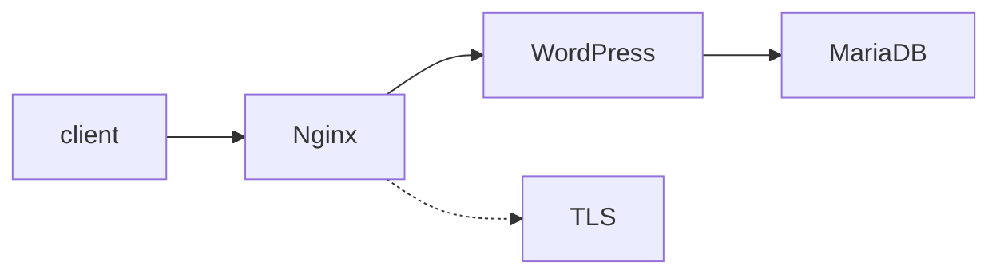

<!-- 🛡️ Best Practice: PHP-FPM

Since we are using NGINX (not Apache), we cannot use standard PHP. NGINX is just a mailman; it doesn't know how to read PHP letters. It needs a translator.

    PHP-FPM (FastCGI Process Manager) is that translator.

    NGINX sends the request -> PHP-FPM executes the code -> PHP-FPM sends HTML back to NGINX.

## 🐛 Troubleshooting


## resources 


### A “Description” 
section that clearly presents the project, including its goal and a brief overview.

### An “Instructions” 
section containing any relevant information about compilation,
installation, and/or execution.

- how to install wordpress
https://developer.wordpress.org/advanced-administration/before-install/howto-install/
- php / Install WP-CLI
https://spinupwp.com/hosting-wordpress-yourself-nginx-php-mysql/
- debian image from docker hub
https://hub.docker.com/_/debian
- mariadb why run as root is good practice
https://mariadb.com/docs/server/security/securing-mariadb/running-mariadbd-as-root


### A “Resources” 
section listing classic references related to the topic (documen-
tation, articles, tutorials, etc.), as well as a description of how AI was used —
specifying for which tasks and which parts of the project. -->




| Task | Command |
| --- | --- |
| Start stack | `docker compose -f srcs/docker-compose.yml up -d` |
| Logs | `docker compose -f srcs/docker-compose.yml logs -f nginx` |
| Tear down | `docker compose -f srcs/docker-compose.yml down -v` |

- [ ] Run lint/tests
- [ ] Update README if configs change

> ⚠️ Expose port 443 only in trusted networks.

# ✔️ Part 0: configs , dockerfiles ✔️
## 1.MariaDB
**conf/50-server.cnf**
```Ini, TOML
[mysqld]

user = mysql
datadir = /var/lib/mysql
socket = /run/mysqld/mysqld.sock
bind-address = 0.0.0.0
port = 3306 
```
`bind-address` is the only thing we changed, all other things already default ones, By default, MariaDB sets this to `127.0.0.1`, which means "Only accept connections from inside this container. Since WordPress is in a *different* container, it is coming from the "outside." Setting this to `0.0.0.0`  tells MariaDB to accept connections from **any IP address** on the network.

**tools/mariadb.sh**
```bash
#!/bin/bash

# actual MariaDB daemon launcher that starts the database process directly
# The & puts it in the background, so the script continues
mysqld_safe &  #  or mariadbd-safe &

# gives MariaDB time to fully initialize and create the socket file (very important)
sleep 5

# Set root password (first time root has no password)
mysql -u root <<EOF
CREATE DATABASE IF NOT EXISTS \`${MADANI_DATABASE}\`;
CREATE USER IF NOT EXISTS '${MADANI_USER}'@'%' IDENTIFIED BY '${MADANI_PASSWORD}';

GRANT ALL PRIVILEGES ON \`${MADANI_DATABASE}\`.* TO '${MADANI_USER}'@'%';
ALTER USER 'root'@'localhost' IDENTIFIED BY '${MADANI_ROOT_PASSWORD}';

FLUSH PRIVILEGES;
EOF

# Shutdown the temporary mariadb service 
mysqladmin -u root -p"${MADANI_ROOT_PASSWORD}" shutdown

# Start MariaDB in foreground
exec mysqld_safe
```

**Dockerfile**
```Dockerfile
FROM debian:bullseye-slim

RUN apt-get update && apt-get install mariadb-server -y

COPY conf/50-server.cnf	/etc/mysql/mariadb.conf.d/50-server.cnf

COPY tools/mariadb.sh .
RUN chmod +x mariadb.sh

ENTRYPOINT ["./mariadb.sh"]
```


## 2.Nginx
there is a way to check if the syntax of the config file is correct with this command `nginx -t` inside the container or if you have nginx on the system as well.
**conf/nginx.conf**
```code
events {
    worker_connections 1024; # Max simultaneous connections per worker
}

http {
	server {
		listen 443 ssl;
		ssl_protocols TLSv1.2 TLSv1.3;

		ssl_certificate /etc/nginx/ssl/1337inception.crt;
		ssl_certificate_key /etc/nginx/ssl/1337inception.key;

		root /var/www/html;
		server_name localhost;
		index index.php index.html index.htm;

		location / {
			try_files $uri $uri/ =404;
		}

		location ~ \.php$ {						
			include snippets/fastcgi-php.conf;
			fastcgi_pass 127.0.0.1:9000;
		}
	}
}

```

`fastcgi_pass wordpress:9000` this line tell Nginx to send PHP requests to wordpress:9000 (By default, PHP-FPM server listening on port 9000 that binds to 127.0.0.1 (localhost).)

**Dockerfile**
```Dockerfile
FROM debian:bullseye-slim

RUN apt-get update && \
    apt-get install nginx openssl -y && \
    mkdir -p /etc/nginx/ssl

RUN openssl req -x509 -nodes -out /etc/nginx/ssl/1337inception.crt -keyout /etc/nginx/ssl/1337inception.key \
    -subj "/CN=eamchart.42.fr"

COPY conf/nginx.conf /etc/nginx/nginx.conf

CMD ["nginx", "-g", "daemon off;"]
```


## 3. WordPress

**wordpress-php.sh**
```bash
#!/bin/bash

# means if any command fails. script stop immediatelly
set -e

mkdir -p /var/www/html

cd /var/www/html

curl -O https://raw.githubusercontent.com/wp-cli/builds/gh-pages/phar/wp-cli.phar
chmod +x wp-cli.phar

php /var/www/html/wp-cli.phar  core download --allow-root
php /var/www/html/wp-cli.phar  config create --dbname=wordpress --dbuser=wpuser --dbpass=password --dbhost=mariadb --allow-root
php /var/www/html/wp-cli.phar  core install --url=localhost --title=inception --admin_user=admin --admin_password=admin --admin_email=admin@admin.com --allow-root


# finally launch it
# -F: PHP-FPM starts, puts itself in the background (daemon off)
/usr/sbin/php-fpm7.3 -F
```

**Dockerfile**
```Dockerfile
FROM debian:bullseye-slim

RUN apt-get update &&  \
    apt-get install -y curl  \
    php7.3 \
	php-fpm	\
    php-mysql mariadb-client

#COPY conf/www.conf /etc/php/7.3/fpm/pool.d/.

COPY tools/wordpress-php.sh .
RUN chmod +x wordpress-php.sh

CMD ["./wordpress-php.sh"]
```


# ✔️ Part 1: Individual Basic Checks ✔️
Since we haven't created the Docker network & docker compose yet,
lets test all the 3 containers manually if everything is working fine.

## 1. Test MariaDB (The Engine)
since you didn't create `.env` file, we'll pass the environment variables manually to mariadb.
```bash
# Go to folder
cd ~/inception/srcs/requirements/mariadb

# Build the image
docker build -t mariadb-img .

# Run it (Manually passing variables)
docker run -d --name mariadb \
  -e MADANI_USER=madanidb \
  -e MADANI_PASSWORD=madani_password \
  -e MADANI_ROOT_PASSWORD=root_password \
  -e MADANI_DATABASE=madani_db mariadb-img


# Test connection as root
docker exec mariadb mysql -u root -p"root_password" -e "SELECT 1;"

# Test connection as the regular user
docker exec mariadb mysql -u madanidb -p"madani_password" -e "SELECT 1;"

# Verify database exists
docker exec mariadb mysql -u madanidb -p"madani_password" -e "SHOW DATABASES;"

```
if you do not encounter any errors with these command, you are good to go


## 2. Test NGINX (The Gatekeeper)

```bash
cd ~/inception/srcs/requirements/nginx

docker build -t nginx-img .

docker run --rm -it --name nginx -p 443:443 nginx-img
```
if you see it hangs (stays running) and doesn't exit. --> ✅ Success

> when you access nginx the homepage `https://localhost` you see and error page often means it is working
Why? Because your NGINX looks in `/var/www/html`, and that folder is currently empty.

now lets test manually a page, we will simple inject a file to that path so that you can see an actual page.
```bash
# this command will create an index.html manually inside the running container
docker exec nginx sh -c 'echo "<h1>Hello from Docker! NGINX is working.</h1>" > /var/www/html/index.html'
```

**Check the Browser**

1. Go to https://localhost (or https://madani.42.fr if you set up your hosts file).
2. Expect a Warning: You will see "Your connection is not private" (because of our self-signed certificate).
3. Bypass it: Click Advanced -> Proceed to... (unsafe).
4. Success: You should see "Hello from Docker! NGINX is working."

## 3. Test WordPress (The App)
This one might complain about missing DB, but PHP-FPM should still start.
```bash
cd ~/inception/srcs/requirements/wordpress

docker build -t wordpress-img .

docker run --rm -it wordpress-img
```
if you see something like :
> Success: WordPress downloaded.
> Error: Database connection error (2002).

all good, sure the connection will fail cause the mariadb container is not running 
(and not connected via a Docker Network), this step is supposed to fail.


# some usefull commands
```bash
# Check logs
# When a container exits immediately, it usually "screamed" an error message, check it with
docker logs test-db

# to copy the config file from the container to your host, (wordpress is container name)
docker cp wordpress:/etc/php/7.4/fpm/pool.d/www.conf .

```


# ✔️ Part 2: Advanced Checks NGINX & WORDPRESS & MariaDB ✔️

- since you don't have connection established between the nginx and php, so they cannot communicate.
so next we need to configure php, and we will make a small modifications to it.
the only thing that you need to change in this config is a line  usually at (36 line) `listen = /run/php/php7.4-fpm.sock` to :
```shell
# The address on which to accept FastCGI requests.
listen = wordpress:9000
```
⚠️ NOTE : make sure your nginx config file has this line `fastcgi_pass wordpress:9000` ,wordpress is the name of your container keep that in mind.
now NGINX can send its work to PHP-FPM which waits in the background on Port 9000.

nginx and wordpress containers are in isolated rooms , we need to put them in the same room to test the connection.

## test NGINX & WORDPRESS
### 🛠️ Step 1: Create a Manual Network 

```bash
docker network create test-net

```
### 🛠️ Step 2: Create a Volume
NGINX cannot look inside the WordPress container's storage. that is why we need to create 
a shared storage space so NGINX can see the files WordPress downloads.

```bash
# create a volume
docker volume create manual-test-vol 
```

### 🛠️ Step 3: Start WordPress

```bash
docker build -t wordpress-img .

docker run --rm -d --name wordpress  --network test-net -v manual-test-vol:/var/www/html \
  -e MADANI_DATABASE=madani_db -e MADANI_USER=madanidb \
  -e MADANI_PASSWORD=madani_password wordpress-img 

```

### 🛠️ Step 4: Start NGINX

Now we start NGINX and attach it to the same network.
```bash
docker build -t nginx-img .
docker run --rm -d --name nginx --network test-net -v manual-test-vol:/var/www/html \
-p 443:443 nginx-img

```
both the containers should stay running so our test would be valid.


### 🛠️ Step 5: test 
If you do this:
1. Go to https://localhost 
2. if you are lucky like me you are gonna see a page like this:

which means **Success**: NGINX served the page & PHP executed the code.
if you click submit you are gonna see this:


This is perfect! It means NGINX found the file, sent it to PHP, and PHP ran.
WordPress needs a database to work, at least know its password, name and host.
All this is configured in the file `wp-config.php`, your job is to configure this file to make the setup automatic. that's why we added the following line in **wordpress-php.sh**
```yaml
wp-cli config create --dbname=$MADANI_DATABASE \
--dbuser=$MADANI_USER --dbpass=$MADANI_PASSWORD \
--dbhost=mariadb:3306 --allow-root 
```

## test MariaDB & WORDPRESS & Nginx

first of all before testing all togother, let's first clean everything
### 🧹 Step 1: Clean

```zsh
# Stop and remove containers
docker stop nginx wordpress mariadb
docker rm nginx wordpress mariadb

# Remove the volume & Volume 
docker volume rm manual-test-vol
docker network rm test-net

# Re-create Network and Volume
docker network create test-net
docker volume create manual-test-vol
```

### 🛠️ Step 2: Start all

```bash
# again create the images
docker build -t mariadb-img .
docker build -t wordpress-img .
docker build -t nginx-img .

# now run the cotainers
docker run --rm -d --name mariadb --network test-net  \
-e MADANI_USER=madanidb -e MADANI_PASSWORD=madani_password \
-e MADANI_ROOT_PASSWORD=root_password -e MADANI_DATABASE=madani_db mariadb-img

docker run --rm -d --name wordpress  --network test-net -v manual-test-vol:/var/www/html \
-e MADANI_DATABASE=madani_db -e MADANI_USER=madanidb \
-e MADANI_PASSWORD=madani_password wordpress-img 

docker run --rm -d --name nginx --network test-net -v manual-test-vol:/var/www/html \
-p 443:443 nginx-img

```
if all goes well you are gonna see this:


```bash
# create the images again cause we changed the script
docker build -t wordpress-img .

# run now the container with the new variables we added
docker run --rm -d --name wordpress  --network test-net -v manual-test-vol:/var/www/html \
-e MADANI_DATABASE=madani_db -e MADANI_USER=madanidb \
-e MADANI_PASSWORD=madani_password -e MADANI_WP_ADMIN_USER=daniel \
-e MADANI_WP_ADMIN_PASSWORD=daniel_password -e MADANI_WP_ADMIN_EMAIL=daniel@gmail.com \
wordpress-img 
```
if all goas well you are gonna see this page


# wordpress error why??
Error: YIKES! It looks like you're running this as root. You probably meant to run this as the user that your WordPress installation exists under.

If you REALLY mean to run this as root, we won't stop you, but just bear in mind that any code on this site will then have full control of your server, making it quite DANGEROUS.

If you'd like to continue as root, please run this again, adding this flag:  --allow-root

If you'd like to run it as the user that this site is under, you can run the following to become the respective user:

    sudo -u USER -i -- wp <command>


`- if you see an error that says "404 Not Found", that means nginx is still looking at its own /var/www/html, which is empty.`